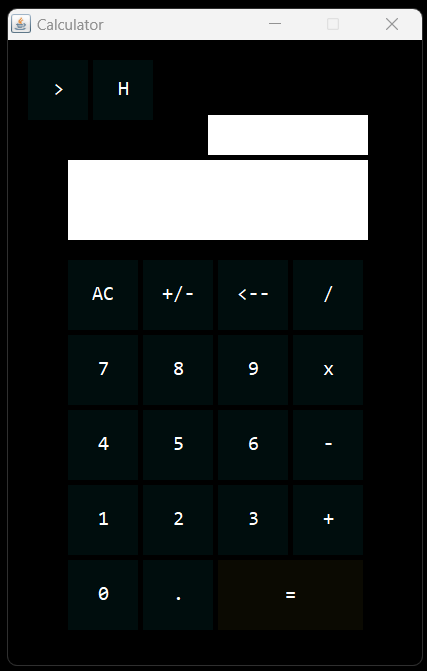
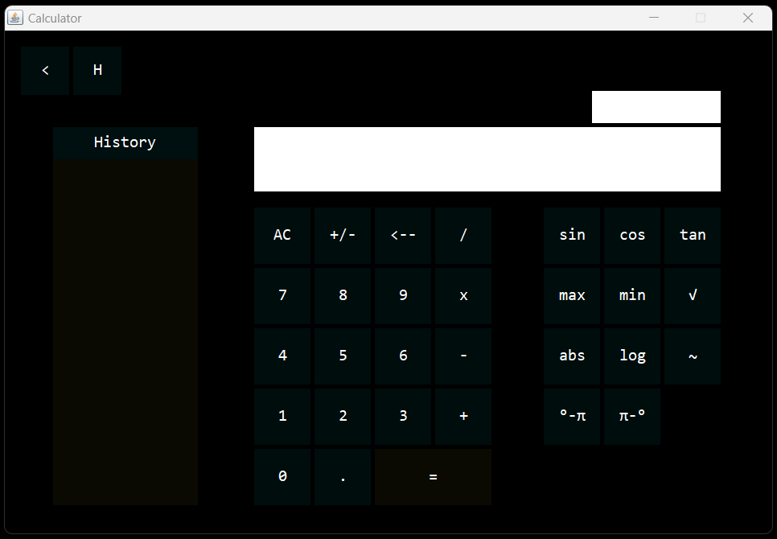
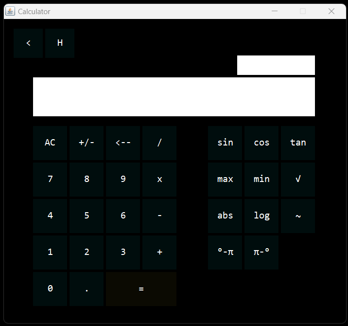
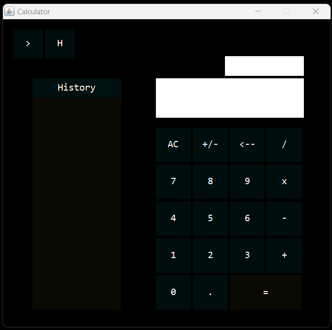

# Calculator
### Language: Java
### IDE: Netbeans

Source code (SC) is found at the folder named "src".
- Calculator.java
    
Normal View of the Calculator.

    
All Features of the Calculator.

    
Scientific View of the Calculator.

    
History View of the Calculator.

    
Programmed by:
HibernatedApe / Yukode